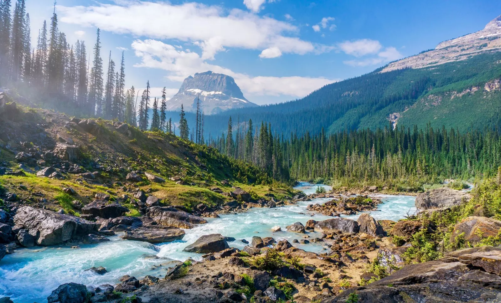
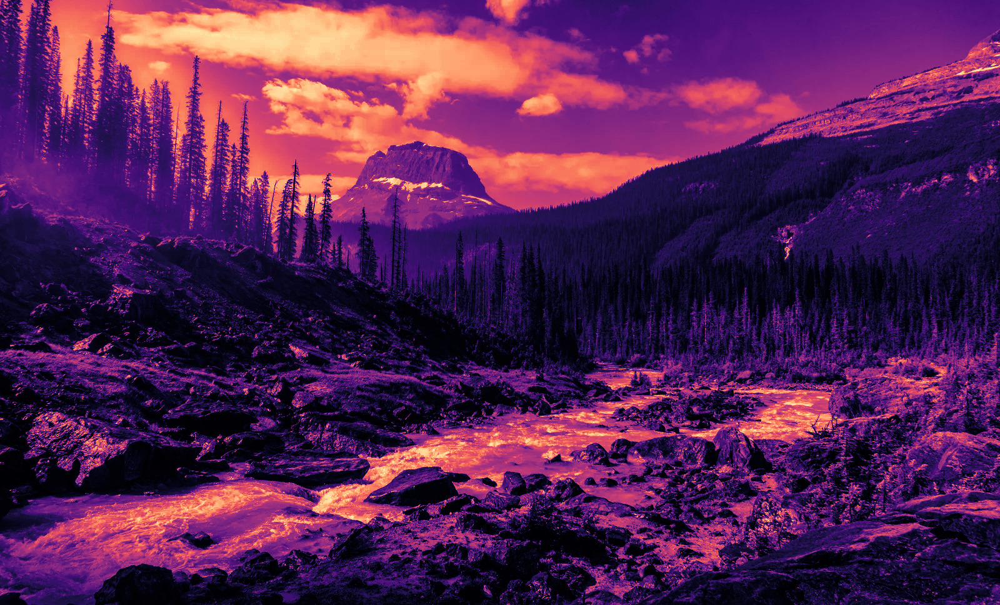
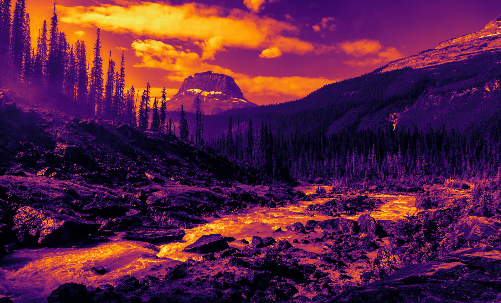
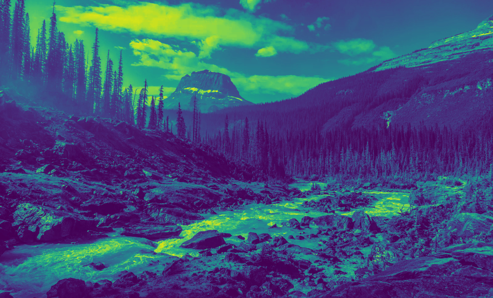
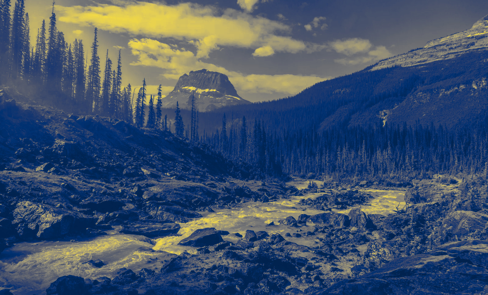
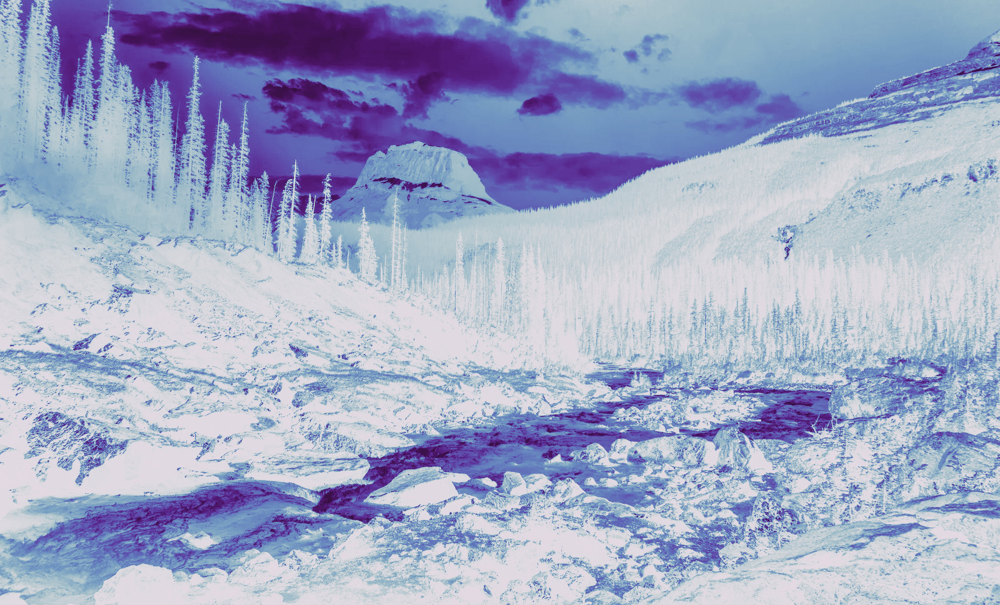
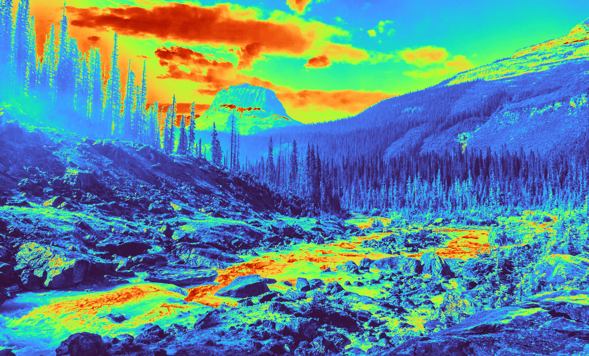

# Colormap

Takes a colormap argument, an image and transforms it by going to greyscale and then to the colormap.

### instalation
```bash
go install github.com/f01c33/colormap@latest
```

### Examples



```bash
colormap magma nature.webp
```


```bash
colormap inferno nature.webp
```



```bash
colormap viridis nature.webp
```



```bash
colormap cividis nature.webp
```



```bash
colormap twilight nature.webp
```



```bash
colormap turbo nature.webp
```
